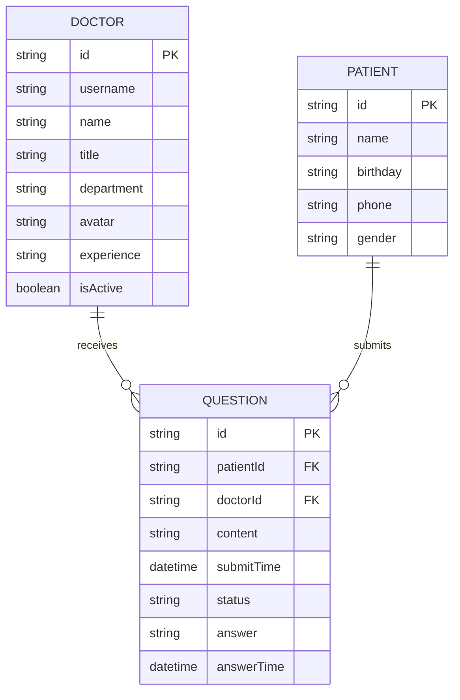

# 产品需求文档 (PRD) 模板

> **文档说明**: 本模板适用于 Healthcare QA 系统的所有功能模块。编写 PRD 时，请根据实际需求填写相应章节。

---

## 文档元信息

| 字段 | 内容 |
|------|------|
| **产品名称** | Healthcare QA System |
| **功能模块** | <填写功能模块名称> |
| **文档版本** | v1.0 |
| **创建日期** | YYYY-MM-DD |
| **最后更新** | YYYY-MM-DD |
| **文档作者** | <填写作者> |
| **文档状态** | 草稿 / 评审中 / 已批准 / 已废弃 |
| **评审人** | <填写评审人> |

---

## 修订历史

| 版本 | 日期 | 作者 | 修订内容 | 评审人 |
|------|------|------|----------|--------|
| v1.0 | YYYY-MM-DD | <作者> | 初始版本 | - |
| | | | | |

---

## 目录

1. [产品概述](#1-产品概述)
2. [用户角色与权限](#2-用户角色与权限)
3. [功能需求](#3-功能需求)
4. [非功能需求](#4-非功能需求)
5. [数据模型](#5-数据模型)
6. [接口规范](#6-接口规范)
7. [测试策略](#7-测试策略)
8. [实施计划](#8-实施计划)
9. [风险管理](#9-风险管理)
10. [附录](#10-附录)

---

## 1. 产品概述

### 1.1 产品背景

<描述产品/功能开发的背景，包括市场现状、用户痛点、业务需求等>

**示例**:
> 当前医疗咨询平台缺少实时在线问诊功能，患者需要到线下医院排队等候，浪费大量时间。通过在线问诊平台，患者可以随时随地与专业医生进行视频/图文咨询，提高医疗资源利用效率。

### 1.2 产品目标

<列出产品/功能的核心目标，建议遵循 SMART 原则（具体的、可衡量的、可实现的、相关的、有时限的）>

| 目标编号 | 目标描述 | 衡量指标 |
|---------|---------|---------|
| GOAL-001 | <目标1> | <指标1> |
| GOAL-002 | <目标2> | <指标2> |

### 1.3 产品范围

**包含范围 (In Scope)**:
- <功能1>
- <功能2>
- <功能3>

**不包含范围 (Out of Scope)**:
- <功能1>
- <功能2>

### 1.4 名词解释

| 术语 | 定义 |
|------|------|
| <术语1> | <定义1> |
| <术语2> | <定义2> |

---

## 2. 用户角色与权限

### 2.1 用户角色定义

| 角色编号 | 角色名称 | 角色描述 | 典型用户 |
|---------|---------|---------|---------|
| ROLE-001 | 患者 | 需要医疗咨询的用户 | 普通用户 |
| ROLE-002 | 医生 | 提供医疗咨询的专业人员 | 执业医师 |
| ROLE-003 | 管理员 | 系统运营管理人员 | 运营人员 |

### 2.2 角色权限矩阵

| 功能模块 | 患者 | 医生 | 管理员 |
|---------|------|------|--------|
| 查看医生列表 | ✅ | ✅ | ✅ |
| 提交问题 | ✅ | ❌ | ❌ |
| 回答问题 | ❌ | ✅ | ❌ |
| 用户管理 | ❌ | ❌ | ✅ |

---

## 3. 功能需求

### 3.1 功能清单

| 功能编号 | 功能名称 | 优先级 | 所属模块 | 用户角色 | 状态 |
|---------|---------|--------|---------|---------|------|
| F-001 | 医生列表展示 | P0 | 医生管理 | 患者 | 规划中 |
| F-002 | 医生登录 | P0 | 医生管理 | 医生 | 规划中 |
| F-003 | 患者身份验证 | P0 | 问诊管理 | 患者 | 规划中 |
| F-004 | 问题提交 | P0 | 问诊管理 | 患者 | 规划中 |
| F-005 | 问题回答 | P0 | 问诊管理 | 医生 | 规划中 |

### 3.2 功能详细描述

#### F-001: 医生列表展示

**功能描述**:
> 患者可以查看所有在线医生列表，包括医生基本信息、职称、科室、擅长领域等。

**用户故事**:
```
作为 患者
我想要 查看所有在线医生的信息
以便于 选择合适的医生进行咨询
```

**验收标准**:
- [ ] 显示所有医生的基本信息（姓名、职称、科室、头像）
- [ ] 显示医生在线状态（在线/离线）
- [ ] 在线医生可以点击"进入诊室"
- [ ] 离线医生显示"暂未开放"并禁用按钮
- [ ] 页面支持中英文切换
- [ ] 响应式设计，支持移动端和桌面端

**业务规则**:
1. 医生列表按在线状态排序（在线医生排在前面）
2. 医生信息每 5 分钟刷新一次
3. 头像加载失败时显示默认头像

**UI/UX 要求**:
- 页面路径: `/doctors`
- 布局方式: 卡片式网格布局
- 响应式断点: 768px（移动端）、1024px（平板）、1920px（桌面）

**优先级**: P0（必须实现）

---

#### F-002: 医生登录

**功能描述**:
> 医生通过用户名和密码登录系统，进入自己的诊室查看患者问题。

**用户故事**:
```
作为 医生
我想要 使用用户名和密码登录系统
以便于 进入诊室回答患者问题
```

**验收标准**:
- [ ] 输入用户名和密码进行登录
- [ ] 登录成功跳转到医生诊室页面
- [ ] 登录失败显示错误提示
- [ ] 支持记住密码功能（可选）

**业务规则**:
1. 用户名和密码验证通过后返回医生详细信息
2. 登录失败超过 5 次锁定账号 30 分钟
3. 会话有效期 24 小时

**接口依赖**:
- `POST /api/doctors/login`

**优先级**: P0（必须实现）

---

#### F-003: 患者身份验证

**功能描述**:
> 患者通过姓名和出生日期进行身份验证，进入诊室咨询。

**用户故事**:
```
作为 患者
我想要 通过姓名和出生日期验证身份
以便于 进入诊室向医生提问
```

**验收标准**:
- [ ] 输入姓名和出生日期
- [ ] 验证成功进入诊室
- [ ] 验证失败提示错误信息
- [ ] 首次验证自动创建患者档案

**业务规则**:
1. 姓名必须为中文或英文字符
2. 出生日期格式为 YYYY-MM-DD
3. 同一天同一患者只能验证一次

**优先级**: P0（必须实现）

---

#### F-004: 问题提交

**功能描述**:
> 患者在诊室中提交医疗问题给医生。

**用户故事**:
```
作为 患者
我想要 向医生提交问题
以便于 获得专业的医疗建议
```

**验收标准**:
- [ ] 输入问题内容
- [ ] 问题字数限制 500 字以内
- [ ] 提交成功后显示在待回答列表中
- [ ] 支持查看自己提交的已回答问题

**业务规则**:
1. 同一诊室最多同时存在 5 个未回答问题
2. 问题提交后自动显示提交时间
3. 问题提交后状态为 "pending"

**接口依赖**:
- `POST /api/questions`

**优先级**: P0（必须实现）

---

#### F-005: 问题回答

**功能描述**:
> 医生在诊室中查看患者问题并进行回答。

**用户故事**:
```
作为 医生
我想要 查看并回答患者的问题
以便于 提供专业的医疗建议
```

**验收标准**:
- [ ] 显示所有待回答问题列表
- [ ] 显示已回答问题列表
- [ ] 支持文本输入回答
- [ ] 回答后自动移动到已回答列表
- [ ] 回答时显示回答时间

**业务规则**:
1. 医生只能查看自己诊室的问题
2. 回答问题后状态变更为 "answered"
3. 已回答的问题不可修改

**接口依赖**:
- `GET /api/questions/doctor/{doctorId}`
- `POST /api/questions/{questionId}/answer`

**优先级**: P0（必须实现）

---

## 4. 非功能需求

### 4.1 性能需求

| 指标 | 要求 | 测试方法 |
|------|------|---------|
| 页面加载时间 | 首屏加载 < 3 秒 | Lighthouse 性能测试 |
| API 响应时间 | 95% 请求 < 500ms | JMeter 压力测试 |
| 并发用户数 | 支持 1000 并发用户 | 负载测试 |
| 数据库查询 | 复杂查询 < 100ms | SQL Explain 分析 |

### 4.2 安全需求

| 安全项 | 要求 |
|--------|------|
| 数据传输 | HTTPS 加密传输 |
| 密码存储 | BCrypt 加密存储 |
| 会话管理 | JWT Token，24 小时过期 |
| XSS 防护 | 输入输出转义 |
| CSRF 防护 | Token 验证 |
| 敏感信息 | 患者隐私数据脱敏显示 |

### 4.3 可用性需求

| 指标 | 要求 |
|------|------|
| 系统可用率 | 99.9%（每年停机时间 < 8.76 小时） |
| 故障恢复时间 | < 30 分钟 |
| 数据备份 | 每日自动备份，保留 30 天 |

### 4.4 兼容性需求

| 平台 | 浏览器 | 版本要求 |
|------|--------|---------|
| Windows | Chrome | 最新版及前两个版本 |
| Windows | Edge | 最新版及前两个版本 |
| macOS | Safari | 最新版及前两个版本 |
| iOS | Safari | iOS 14+ |
| Android | Chrome | Android 10+ |

### 4.5 国际化需求

- 支持语言: 中文 (zh-CN)、英文 (en)
- 默认语言: 根据浏览器语言设置
- 语言切换: 页面右上角语言切换按钮
- 文本资源: 使用 i18n 管理，存放在 `src/locales/`

---

## 5. 数据模型

### 5.1 核心实体关系图



### 5.2 数据表结构

#### doctors (医生表)

| 字段名 | 类型 | 长度 | 约束 | 说明 |
|--------|------|------|------|------|
| id | VARCHAR | 32 | PK | 医生ID |
| username | VARCHAR | 64 | UNIQUE, NOT NULL | 登录用户名 |
| password | VARCHAR | 255 | NOT NULL | 登录密码 |
| name | VARCHAR | 64 | NOT NULL | 医生姓名 |
| title | VARCHAR | 64 | NOT NULL | 职称 |
| department | VARCHAR | 64 | NOT NULL | 科室 |
| avatar | VARCHAR | 512 | - | 头像URL |
| experience | VARCHAR | 128 | - | 从业经验 |
| is_active | TINYINT | 1 | NOT NULL, DEFAULT 0 | 是否在线 |
| created_at | TIMESTAMP | - | NOT NULL | 创建时间 |
| updated_at | TIMESTAMP | - | NOT NULL | 更新时间 |

#### patients (患者表)

| 字段名 | 类型 | 长度 | 约束 | 说明 |
|--------|------|------|------|------|
| id | VARCHAR | 32 | PK | 患者ID |
| name | VARCHAR | 64 | NOT NULL | 患者姓名 |
| birthday | VARCHAR | 10 | NOT NULL | 出生日期 |
| phone | VARCHAR | 20 | - | 联系电话 |
| gender | VARCHAR | 10 | - | 性别 |

#### questions (问题表)

| 字段名 | 类型 | 长度 | 约束 | 说明 |
|--------|------|------|------|------|
| id | VARCHAR | 32 | PK | 问题ID |
| patient_id | VARCHAR | 32 | FK, NOT NULL | 患者ID |
| doctor_id | VARCHAR | 32 | FK, NOT NULL | 医生ID |
| content | TEXT | - | NOT NULL | 问题内容 |
| status | VARCHAR | 20 | NOT NULL | 状态: pending/answered |
| submit_time | TIMESTAMP | - | NOT NULL | 提交时间 |
| answer | TEXT | - | - | 回答内容 |
| answer_time | TIMESTAMP | - | - | 回答时间 |

---

## 6. 接口规范

### 6.1 接口清单

| 接口编号 | 接口路径 | 方法 | 功能描述 | 优先级 |
|---------|---------|------|---------|--------|
| API-001 | `/api/doctors` | GET | 获取所有医生列表 | P0 |
| API-002 | `/api/doctors/active` | GET | 获取活跃医生列表 | P0 |
| API-003 | `/api/doctors/{username}` | GET | 获取医生详情 | P0 |
| API-004 | `/api/doctors/login` | POST | 医生登录 | P0 |
| API-005 | `/api/questions` | POST | 提交问题 | P0 |
| API-006 | `/api/questions/doctor/{doctorId}` | GET | 获取医生的问题列表 | P0 |
| API-007 | `/api/questions/{questionId}/answer` | POST | 回答问题 | P0 |

### 6.2 接口详细定义

#### API-001: 获取所有医生列表

**请求**:
```http
GET /api/doctors
```

**响应**:
```json
{
  "code": 200,
  "message": "success",
  "data": [
    {
      "id": "doc001",
      "username": "dr-zhang-wei",
      "name": "张伟医生",
      "title": "主任医师",
      "department": "心内科",
      "avatar": "https://example.com/avatar.jpg",
      "experience": "15年临床经验",
      "isActive": true,
      "specialties": ["高血压", "冠心病", "心律失常"]
    }
  ]
}
```

**状态码**:
| 状态码 | 说明 |
|--------|------|
| 200 | 成功 |
| 500 | 服务器内部错误 |

---

#### API-004: 医生登录

**请求**:
```http
POST /api/doctors/login
Content-Type: application/json

{
  "username": "dr-zhang-wei",
  "password": "123456"
}
```

**响应**:
```json
{
  "code": 200,
  "message": "success",
  "data": {
    "id": "doc001",
    "username": "dr-zhang-wei",
    "name": "张伟医生",
    "title": "主任医师",
    "department": "心内科",
    "avatar": "https://example.com/avatar.jpg",
    "experience": "15年临床经验",
    "isActive": true,
    "specialties": ["高血压", "冠心病", "心律失常"]
  }
}
```

**状态码**:
| 状态码 | 说明 |
|--------|------|
| 200 | 登录成功 |
| 400 | 参数错误 |
| 401 | 用户名或密码错误 |
| 429 | 登录次数过多，请稍后重试 |

---

## 7. 测试策略

### 7.1 测试范围

| 测试类型 | 范围 | 负责人 |
|---------|------|--------|
| 单元测试 | 所有 Service、Repository 类 | 开发团队 |
| 集成测试 | API 接口、数据库操作 | 开发团队 |
| 功能测试 | 所有用户故事 | 测试团队 |
| 性能测试 | 接口响应、并发用户 | 测试团队 |
| 安全测试 | 权限控制、数据加密 | 安全团队 |

### 7.2 测试用例示例

#### TC-001: 医生列表展示

**前置条件**:
- 数据库中存在医生数据
- 至少有一个医生 isActive=true

**测试步骤**:
1. 打开浏览器，访问 `/doctors` 页面
2. 查看医生列表展示

**预期结果**:
- 显示所有医生信息
- 在线医生显示"在线"状态和"进入诊室"按钮
- 离线医生显示"离线"状态和"暂未开放"按钮
- 点击在线医生"进入诊室"按钮跳转到咨询页面

**优先级**: P0

---

#### TC-002: 医生登录

**前置条件**:
- 医生账号已存在于数据库

**测试步骤**:
1. 访问 `/doctor/login` 页面
2. 输入正确的用户名和密码
3. 点击"登录"按钮

**预期结果**:
- 登录成功，跳转到 `/doctor/room/{username}` 页面
- 页面显示医生个人信息

**测试数据**:
- 用户名: `dr-zhang-wei`
- 密码: `123456`

**优先级**: P0

---

### 7.3 测试环境

| 环境 | 用途 | URL |
|------|------|-----|
| 开发环境 | 开发自测 | http://localhost:5173 |
| 测试环境 | 功能测试 | http://test.example.com |
| 预发布环境 | 验收测试 | http://staging.example.com |
| 生产环境 | 线上运行 | http://www.example.com |

---

## 8. 实施计划

### 8.1 里程碑

| 里程碑 | 完成日期 | 交付物 | 负责人 |
|--------|---------|--------|--------|
| 需求评审 | YYYY-MM-DD | PRD 文档、评审记录 | 产品经理 |
| 设计完成 | YYYY-MM-DD | UI 设计稿、接口文档 | 设计师、架构师 |
| 开发完成 | YYYY-MM-DD | 可运行版本、代码 | 开发团队 |
| 测试完成 | YYYY-MM-DD | 测试报告、Bug 清单 | 测试团队 |
| 上线发布 | YYYY-MM-DD | 生产环境部署 | 运维团队 |

### 8.2 任务分解

| 任务编号 | 任务名称 | 优先级 | 估时 | 负责人 | 状态 |
|---------|---------|--------|------|--------|------|
| T-001 | 数据库表结构设计与创建 | P0 | 2 天 | DBA | 待开始 |
| T-002 | 后端 API 开发 - 医生模块 | P0 | 3 天 | 后端开发 | 待开始 |
| T-003 | 后端 API 开发 - 问诊模块 | P0 | 4 天 | 后端开发 | 待开始 |
| T-004 | 前端页面开发 - 医生列表 | P0 | 2 天 | 前端开发 | 待开始 |
| T-005 | 前端页面开发 - 诊室页面 | P0 | 3 天 | 前端开发 | 待开始 |
| T-006 | 前后端联调 | P0 | 2 天 | 开发团队 | 待开始 |
| T-007 | 功能测试 | P0 | 3 天 | 测试团队 | 待开始 |
| T-008 | 性能测试 | P1 | 2 天 | 测试团队 | 待开始 |

### 8.3 资源需求

| 资源类型 | 数量 | 说明 |
|---------|------|------|
| 前端开发 | 1 人 | Vue 3 + TypeScript |
| 后端开发 | 1 人 | Spring Boot + Java 17 |
| 测试工程师 | 1 人 | 功能测试、自动化测试 |
| UI 设计师 | 0.5 人 | 页面设计 |
| 服务器 | 2 台 | 应用服务器、数据库服务器 |

---

## 9. 风险管理

### 9.1 风险识别

| 风险编号 | 风险描述 | 可能性 | 影响程度 | 风险等级 |
|---------|---------|--------|---------|---------|
| RISK-001 | 需求变更频繁 | 中 | 高 | 高 |
| RISK-002 | 开发人员技能不足 | 低 | 中 | 低 |
| RISK-003 | 第三方接口不稳定 | 中 | 高 | 高 |
| RISK-004 | 数据安全合规风险 | 低 | 高 | 中 |
| RISK-005 | 项目延期 | 中 | 中 | 中 |

### 9.2 风险应对策略

#### RISK-001: 需求变更频繁

**应对策略**:
- 建立需求变更控制流程
- 所有需求变更需经过评审
- 设定需求冻结期（开发阶段不允许变更）

**负责人**: 产品经理

---

#### RISK-003: 第三方接口不稳定

**应对策略**:
- 添加接口超时和重试机制
- 实现降级方案（缓存数据、友好提示）
- 监控第三方接口可用性

**负责人**: 架构师

---

## 10. 附录

### 10.1 参考资料

| 资料名称 | 链接 | 说明 |
|---------|------|------|
| Vue 3 官方文档 | https://vuejs.org/ | 前端框架文档 |
| Spring Boot 文档 | https://spring.io/projects/spring-boot | 后端框架文档 |
| Ant Design Vue | https://antdv.com/ | UI 组件库文档 |
| MySQL 文档 | https://dev.mysql.com/doc/ | 数据库文档 |

### 10.2 评审记录

| 评审日期 | 评审人 | 评审意见 | 处理结果 |
|---------|--------|---------|---------|
| YYYY-MM-DD | <评审人> | <意见内容> | 已修改 / 已采纳 / 已拒绝 |

### 10.3 审批记录

| 审批角色 | 审批人 | 审批意见 | 审批日期 | 状态 |
|---------|--------|---------|---------|------|
| 产品经理 | <审批人> | - | - | 待审批 |
| 技术负责人 | <审批人> | - | - | 待审批 |
| 项目经理 | <审批人> | - | - | 待审批 |

---

## 文档编写规范

### 必填项

以下章节为必填项，不可省略：

1. ✅ 文档元信息
2. ✅ 产品概述（背景、目标、范围）
3. ✅ 用户角色与权限
4. ✅ 功能需求（至少包含功能清单和一个功能的详细描述）
5. ✅ 非功能需求（至少包含性能需求）
6. ✅ 接口规范（至少包含接口清单和一个接口的详细定义）
7. ✅ 测试策略（至少包含测试范围和测试用例）

### 选填项

以下章节可根据实际需求省略或简化：

- 📝 数据模型（如不涉及复杂数据关系可简化）
- 📝 风险管理（小型项目可简化）
- 📝 实施计划（可根据项目管理方式调整）

### 格式规范

1. **优先级标注**:
   - P0: 必须实现（MVP 功能）
   - P1: 应该实现（重要功能）
   - P2: 可以实现（锦上添花）

2. **用户故事格式**:
   ```
   作为 <角色>
   我想要 <动作>
   以便于 <价值>
   ```

3. **验收标准格式**:
   - 使用复选框列表 `[ ]`
   - 每条标准应该是可验证的

4. **接口文档格式**:
   - 包含请求方法、路径、参数、响应示例
   - 说明所有可能的状态码

---

**文档结束**
